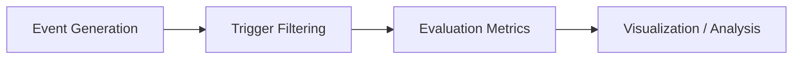

# Real-Time Particle Event Trigger System Simulation with Statistical and Machine Learning-Based Filtering

## Overview
This project explores how real-time filtering works in high-throughput data systems, inspired by trigger pipelines used in particle physics experiments (e.g., at CERN).

In such environments, an enormous number of events are generated every second, but only a tiny fraction are actually useful. The goal here was to simulate that scenario and study how different filtering strategies perform under varying conditions.

---

## Problem Statement
Modern particle physics experiments generate far more data than can be stored or processed offline. This makes **real-time decision systems (triggers)** essential, they must quickly decide which events to keep and which to discard.

In this project, I simulate a simplified version of such a system:
- A stream of synthetic particle events is generated  
- Each event is evaluated in real time  
- A decision is made to **accept (signal)** or **reject (background noise)**  

The challenge is to maximize signal detection while minimizing false positives.

---

## System Architecture



### Event Generation
- Synthetic data is generated using probabilistic sampling  
- Each event includes features like:
  - energy  
  - momentum  
  - noise level  
- A hidden ground truth defines whether an event is **signal** or **background**  
- Signal-to-Noise Ratio (SNR) is configurable  

This setup allows controlled experimentation with different filtering strategies.

---

### Trigger System
Each incoming event is classified as:
- Accept (potential signal)  
- Reject (background noise)  

Three different approaches are implemented.

---

### Evaluation Metrics
Performance is measured using:
- **Recall (Signal Efficiency)**  
- **Precision**  
- **F1 Score**  
- **Background Rejection Rate (True Negative Rate)**  

---

## Trigger Methods

### 1. Rule-Based Filtering
A baseline approach using fixed thresholds.

Example:
`accept if energy > threshold AND noise < threshold`

**Pros:**
- Very fast  
- Easy to interpret  

**Cons:**
- Sensitive to threshold selection  
- Cannot capture complex relationships  

---

### 2. Statistical Filtering
Models background distributions and detects anomalies.
- Uses probability distributions  
- Accepts events with low p-values  

**Pros:**
- Effective for well-behaved distributions  

**Cons:**
- Struggles with skewed or complex data  

---

### 3. Machine Learning Filtering
Uses models such as:
- Logistic Regression  
- Decision Trees  

These learn patterns across multiple features.

**Pros:**
- Captures nonlinear relationships  
- Best overall performance in most cases  

**Cons:**
- Higher computational cost  
- Harder to deploy in real-time systems  

---

## Results & Observations
- Rule-based methods are fast but unreliable in edge cases  
- Statistical methods work well under ideal assumptions but lack flexibility  
- Machine learning provides the best balance between detection and rejection  

However, ML introduces deployment challenges in real-time, resource-constrained environments.

---

## Real-World Relevance
This project approximates real-world systems used in particle physics:

- **Trigger Systems (LHC):** concepts similar to Level-1 and High-Level Triggers  
- **High-Throughput Filtering:** applicable to financial systems and astrophysics event detection  
- **Data Pipelines:** demonstrates filtering before storage in large-scale systems  

---

## Getting Started

### Installation
```bash
python -m venv .venv
source .venv/bin/activate   # Windows: .venv\Scripts\Activate.ps1
pip install -r requirements.txt
```

### Run the App
```bash
streamlit run app.py
```

### Explore Notebook
`notebooks/trigger_analysis.ipynb`

---

## Notes
This project is a simplified simulation designed to build an intuitive and computational understanding of how real-time filtering systems behave under different data conditions.
